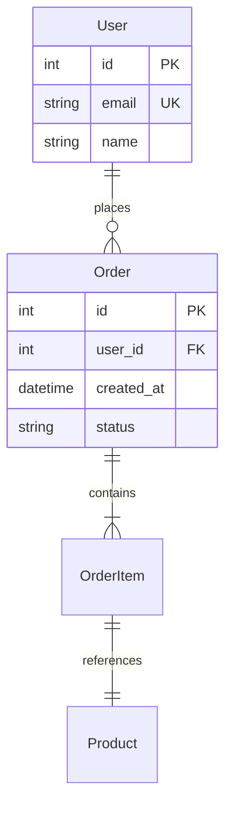

# Проектирование и администрирование БД

---

## Схемы и моделирование

### Entity-Relationship (ER) Model



### Типы связей

| Тип | Пример | Реализация |
|-----|--------|------------|
| **1:1** | User ↔ Profile | FK с UNIQUE в одной из таблиц |
| **1:N** | User → Orders | FK в таблице Order |
| **N:M** | Product ↔ Category | Junction table (product_categories) |

---

## Миграции (Schema Migrations)

### Entity Framework Core

```csharp
// Создание миграции
// dotnet ef migrations add AddOrderTable

public partial class AddOrderTable : Migration
{
    protected override void Up(MigrationBuilder migrationBuilder)
    {
        migrationBuilder.CreateTable(
            name: "Orders",
            columns: table => new
            {
                Id = table.Column<int>(type: "int", nullable: false)
                    .Annotation("SqlServer:Identity", "1, 1"),
                UserId = table.Column<int>(nullable: false),
                Status = table.Column<string>(maxLength: 50, nullable: false),
                CreatedAt = table.Column<DateTime>(nullable: false)
            });

        migrationBuilder.CreateIndex(
            name: "IX_Orders_UserId",
            table: "Orders",
            column: "UserId");
    }

    protected override void Down(MigrationBuilder migrationBuilder)
    {
        migrationBuilder.DropTable(name: "Orders");
    }
}
```

### Принципы миграций

1. **Idempotent** — можно применить несколько раз
2. **Forward-only** — Down-миграции опасны в production
3. **Small + frequent** — маленькие миграции, часто
4. **Backward compatible** — старый код работает с новой схемой

### Expand-Migrate-Contract (три фазы)

```
Phase 1: Expand — добавить новое поле/таблицу (старый код ignores)
Phase 2: Migrate — переписать весь код на новую схему
Phase 3: Contract — удалить старые поля/таблицы
```

---

## Шардинг (Sharding)

### Horizontal Sharding (разделение строк)

```
Shard 0: users 1-1000000
Shard 1: users 1000001-2000000
Shard 2: users 2000001-3000000
```

**Ключ шардирования (Shard Key):** выбирать равномерно распределяющий данные (user_id, но не country).

### Vertical Sharding (разделение колонок)

```
Table users_profile: id, email, name
Table users_preferences: id, theme, language
```

### Проблемы шардинга

| Проблема | Описание |
|----------|----------|
| **Resharding** | Перераспределение при росте — сложно |
| **Cross-shard queries** | JOIN'ы по разным шардам — медленно |
| **Transactions** | ACID через шарды — 2PC или Saga |
| **Shard key choice** | Неправильный ключ → горячие шарды |

---

## Репликация

### Типы

```
┌──────────┐          ┌──────────┐
│  Primary │ ──sync──→│  Replica │  Synchronous (commit on both)
└──────────┘          └──────────┘

┌──────────┐          ┌──────────┐
│  Primary │ ──async─→│  Replica │  Asynchronous (lag possible)
└──────────┘          └──────────┘
```

### Use cases

| Тип | Использование |
|-----|--------------|
| **Read replicas** | Масштабирование read-нагрузки (SELECT) |
| **DR (Disaster Recovery)** | Реплика в другом регионе |
| **High Availability** | Автоматический failover (Patroni, PostgreSQL HA) |

### Connection Strings with Read/Write Splitting

```csharp
// Npgsql with load balancing
"Host=pg-primary,pg-replica1,pg-replica2;Database=mydb;Load Balance Hosts=true"
```

---

## Бэкапы

### Стратегия

| Тип | Размер | Скорость восстановления | Частота |
|-----|--------|------------------------|---------|
| **Full** | Большой | Медленно | Раз в день/неделю |
| **Incremental** | Маленький | Быстро (если есть full) | Каждый час |
| **WAL archiving** | Минимальный | Point-in-time recovery | Непрерывно |

### PostgreSQL — pg_dump / pgBackRest

```bash
# Full backup
pg_dump -Fc -U postgres -d mydb > mydb.backup

# Restore
pg_restore -U postgres -d mydb mydb.backup

# Continuous archiving (WAL)
pgbackrest --stanza=mydb --type=full backup
pgbackrest --stanza=mydb --type=incr backup
```

### 3-2-1 правило

```
3 — как минимум 3 копии данных
2 — на 2 разных носителях
1 — 1 копия офлайн (off-site)
```

---

## Connection Pooling

### Проблема

```csharp
// ❌ Каждый запрос — новое соединение (дорого)
using var conn = new NpgsqlConnection(connectionString);
await conn.OpenAsync();  // TCP handshake + auth (~10-50ms)
```

### Решение

```csharp
// ✅ Connection pool управляется провайдером
builder.Services.AddNpgsqlDataSource(connectionString, options =>
{
    options.MaxPoolSize = 100;
    options.MinPoolSize = 10;
    options.ConnectionLifetime = 300; // 5 минут
});
```

### Оптимальные настройки

| Параметр | Рекомендация |
|----------|-------------|
| MaxPoolSize | `CPU_cores × 2 + effective_spindle_count` |
| Connection Lifetime | 5-30 минут (чтобы избежать stale connections) |
| Pooling | Всегда включено (закрывать DB connection = вернуть в pool) |

---

## Мониторинг БД

### Ключевые метрики

| Метрика | Что показывает |
|---------|----------------|
| **Active connections** | Утилизация пула |
| **Query latency (p50/p95/p99)** | Производительность запросов |
| **Slow queries** | Запросы > 100ms/1s |
| **Cache hit ratio** | % данных из shared_buffers (цель: > 99%) |
| **Disk I/O (reads/writes)** | Нагрузка на диск |
| **Replication lag** | Отставание реплик |
| **Deadlocks** | Конфликты транзакций |

### PostgreSQL — pg_stat_statements

```sql
SELECT query, calls, total_time / calls as avg_time_ms,
       rows, shared_blks_hit, shared_blks_read
FROM pg_stat_statements
ORDER BY total_time DESC
LIMIT 10;
```

---

## Чек-лист администрирования

- [ ] Регулярные бэкапы (full + WAL) протестированы восстановлением
- [ ] Мониторинг настроен (slow queries, connections, replication lag)
- [ ] Connection pooling настроен оптимально
- [ ] Миграции backward-compatible
- [ ] Регулярный VACUUM / ANALYZE (PostgreSQL)
- [ ] Индексы проверены на фрагментацию
- [ ] Пароли и sensitive data в Secrets Manager, не в connection string
- [ ] Disaster Recovery план протестирован
- [ ] TLS для соединений с БД
- [ ] Пользователи — least privilege
